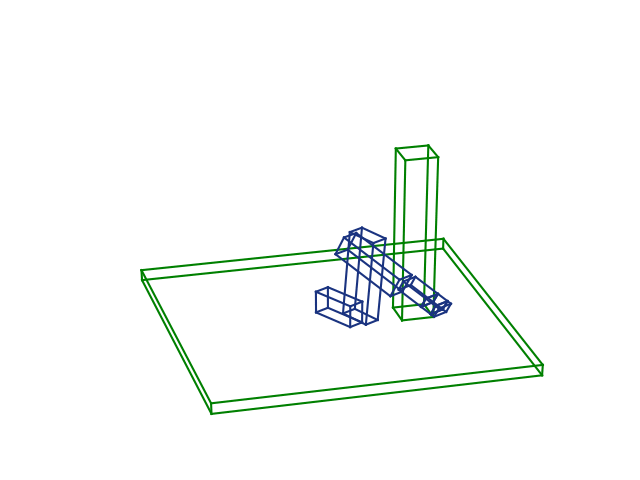

# MoveIt kinematics plugin

[https://github.com/JeroenDM/moveit_opw_kinematics_plugin](https://github.com/JeroenDM/moveit_opw_kinematics_plugin)

After working with the analytical inverse kinematics library [opw kinematics](https://github.com/Jmeyer1292/opw_kinematics). I decided to try writing a MoveIt kinematics plugin for it. The plugin has evolved a bit and I was lucky enough to get some help from [@simonschmeisser](https://github.com/simonschmeisser).

# 3D Python Robotics

[https://github.com/JeroenDM/acrobotics](https://github.com/JeroenDM/acrobotics)

As an extension of Planar Python Robotics below, I started implementing simple motion planning algorithms in 3D. The lines of code quickly got out of hand, so I also organized this code in a Python package. Common utilities are factored out in a separate packages called [acrolib](https://github.com/JeroenDM/acrolib).

<!--  -->

# Planar Python Robotics

[https://gitlab.mech.kuleuven.be/u0100037/planar_python_robotics](https://gitlab.mech.kuleuven.be/u0100037/planar_python_robotics)

To learn about the details of robot motion planning, I started with as simple 2D implementation of some typical funcionality needed by motion planning algorithms. This lead to a Python package called `ppr`, available on [Pypi](https://pypi.org/project/ppr/). For more info, see the [documentation page](https://u0100037.pages.mech.kuleuven.be/planar_python_robotics/).